# LangGraph Agentic AI

A practical, notebook-first collection for learning how to build agentic applications with
[LangGraph](https://langchain-ai.github.io/langgraph/) and LangChain. The examples progress
from a single LLM node to stateful chatbots, tool-using agents, retrieval-augmented
generation (RAG), human approval loops, multi-agent systems, map-reduce workflows, and
long-term memory.

The project is designed to be opened and executed one notebook at a time. Each notebook
builds a graph from typed state, nodes, and edges, then compiles and invokes the graph.

## What is covered

- Graph fundamentals: `StateGraph`, `START`, `END`, typed state, conditional routing, and
  graph visualization
- LLM workflows: question answering, sentiment-aware review replies, X posts, and LinkedIn
  content generation
- Tool calling: ReAct-style agents, SQL agents, web search, and custom tools
- Memory and persistence: in-memory checkpoints, SQLite checkpoints, short-term memory, and
  PostgreSQL-backed long-term memory
- RAG: simple retrieval, advanced query rewriting and grading, web-search fallbacks, and
  answer summarization
- Orchestration patterns: human-in-the-loop approval, map-reduce fan-out/fan-in, and
  supervisor-style multi-agent routing
- Applied examples: travel planning, WhatsApp integration, and personalized chat

## Repository layout

| Path | Purpose |
| --- | --- |
| `1_simple_llm_workflow.ipynb` | Smallest graph: one LLM question-answering node |
| `2_sentiment_review_reply_workflow.ipynb` | Sentiment classification, diagnosis, and response routing |
| `3_simple_rag-agent.ipynb` | Basic tool-using RAG agent |
| `4_X_post_generator_workflow.ipynb` | Generate and refine a short social post |
| `5_chatbot_with_InMemory_saver.ipynb` | Chatbot with in-memory checkpoints |
| `6_sqlite_saver.py` | Persistent chatbot using `SqliteSaver` and `bot_checkpoint.sqlite` |
| `7_persistence_memory.ipynb` | Persisted graph state and memory concepts |
| `8_tools.ipynb` | Tool definitions and tool-node execution |
| `9_HITL.ipynb` | Human-in-the-loop draft review and approval |
| `9_linkedin_langgraph_workflow.ipynb` | LinkedIn content workflow |
| `10_map_reduce.ipynb` | Map-reduce orchestration with `Send` and `Command` |
| `10_*pdf*.ipynb` | Sequential and parallel PDF word-count examples |
| `11_multiagent.ipynb` | Researcher and chart-generator agent collaboration |
| `12_travel_assistant.ipynb` | Conversational travel planning and booking flow |
| `12_sql_react_agent/` | SQL ReAct agent and the sample `sales.db` database |
| `13_advance_rag.ipynb` | Query rewriting, classification, retrieval grading, refinement, and web search |
| `14_short_term_memory.ipynb` | Conversation summarization for short-term context |
| `15_Improved_RAG_summarization.ipynb` | RAG answer generation followed by conversation summarization |
| `16_whatsapp_agent.ipynb` | WhatsApp-oriented agent integration |
| `17_langgraph_long_term_memory.ipynb` | Long-term memory concepts and storage |
| `18_langgraph_personalized_chatbot_sachin.ipynb` | Personalized chatbot using stored user information |
| `19_ltm_postgres.ipynb` | PostgreSQL-backed long-term memory |
| `financial_pdfs/` and `pdfs/` | PDFs used by document and RAG examples |
| `graphs/` | Supporting graph assets |
| `requirements.txt` | Pinned Python dependencies |
| `docker-compose.yml` | PostgreSQL 16 service for database-backed examples |

## Prerequisites

- Python 3.10 or newer
- Jupyter Notebook or JupyterLab
- An OpenAI and/or Groq API key, depending on the notebook
- Docker Desktop, only for the PostgreSQL examples
- A Twilio account and credentials, only for the WhatsApp example

## Installation

From this directory, create and activate a virtual environment:

```powershell
py -m venv .venv
.\.venv\Scripts\Activate.ps1
python -m pip install --upgrade pip
pip install -r requirements.txt
```

Start Jupyter:

```powershell
jupyter notebook
```

Then open `1_simple_llm_workflow.ipynb` and continue through the examples in order. The
notebooks are independent experiments, so later notebooks can also be opened directly when
their prerequisites are available.

## Environment variables

Create a local `.env` file in this directory. Do not commit it; the repository `.gitignore`
already excludes `.env` files.

```dotenv
OPENAI_API_KEY=your-openai-key
GROQ_API_KEY=your-groq-key
OPENAI_CHAT_MODEL=gpt-4.1

# Required only by 16_whatsapp_agent.ipynb
TWILIO_AUTH_TOKEN=your-twilio-auth-token
```

Most notebooks call `load_dotenv()` and read the provider key at runtime. Use the provider
expected by the notebook rather than adding all keys to a shared environment. Never place
real credentials in notebook cells or source control.

## First graph

The core pattern used throughout the project is a typed state object, one or more nodes, and
explicit graph edges:

```python
from typing import TypedDict
from langgraph.graph import END, START, StateGraph


class LLMState(TypedDict):
    question: str
    answer: str


def llm_qa(state: LLMState) -> dict[str, str]:
    response = llm.invoke(state["question"])
    return {"answer": response.content}


builder = StateGraph(LLMState)
builder.add_node("llm_qa", llm_qa)
builder.add_edge(START, "llm_qa")
builder.add_edge("llm_qa", END)

workflow = builder.compile()
result = workflow.invoke({"question": "What is LangGraph?", "answer": ""})
```

The complete provider setup and graph visualization are available in
`1_simple_llm_workflow.ipynb`.

## Workflow gallery

### Basic graph and routing

#### 1_simple_llm_workflow
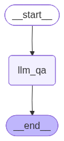

#### 2_sentiment_review_reply_workflow
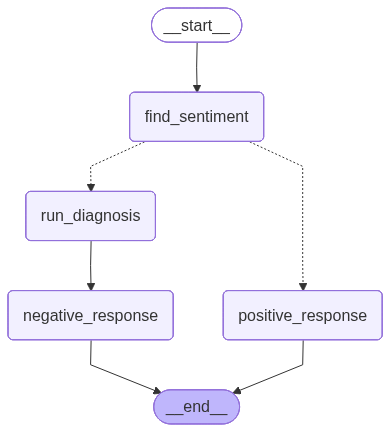

#### 3_simple_rag-agent
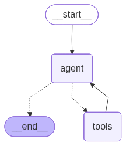

#### 4_X_post_generator_workflow
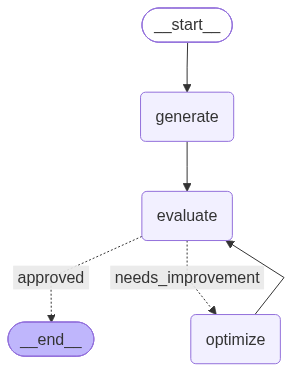

### Persistence and retrieval

#### 5_chatbot_with_InMemory_saver
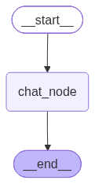

#### 6_sqlite_saver


#### 7_persistence_memory
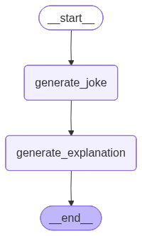

#### 8_tools
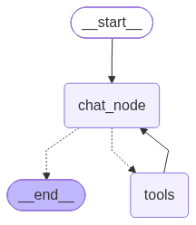

#### 9_HITL
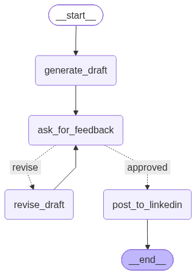

#### 9_linkedin_langgraph_workflow
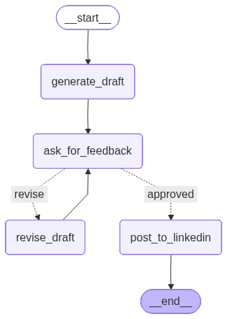

#### 10_map_reduce
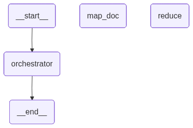

#### 11_multiagent
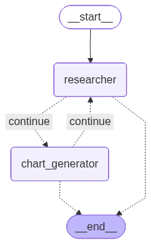

#### 11_multiagent_viualize
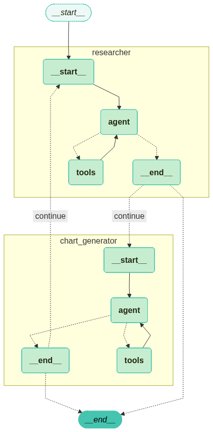

#### 12_travel_assistant
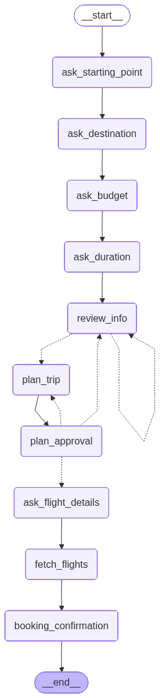

#### 13_advance_rag
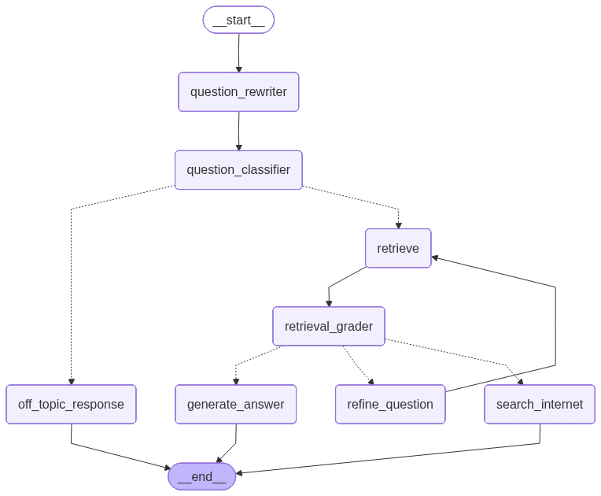

#### 13_advance_rag2
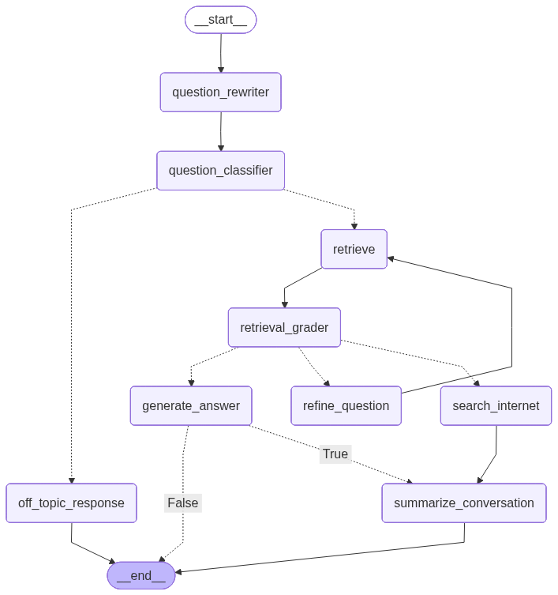

#### 14_short_term_memory_trimming
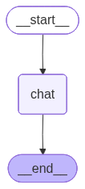

#### 14_short_term_memory_summerizing
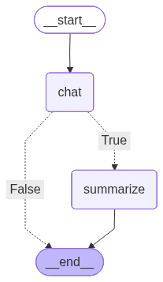

#### 14_short_term_memory_deleting
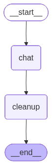

#### 15_Improved_RAG_summarization


#### 18_langgraph_personalized_chatbot_sachin
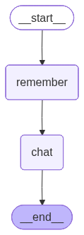

#### 08_multiagent_workflow


## Persistence and databases

The SQLite example stores LangGraph checkpoints in `bot_checkpoint.sqlite` and uses a
`thread_id` to resume a conversation:

```python
config = {"configurable": {"thread_id": "1"}}
result = chatapp.invoke(
    {"messages": [HumanMessage(content=user_input)]},
    config=config,
)
```

For the PostgreSQL examples, start the included service:

```powershell
docker compose up -d postgres
```

The compose file exposes PostgreSQL on `localhost:5442` with the development credentials
declared in `docker-compose.yml`. Stop it when finished:

```powershell
docker compose down
```

Use development credentials only. Change them before using this compose file outside a local
learning environment.

## Running PDF and RAG examples

The PDF notebooks read documents from `financial_pdfs/` or `pdfs/`. Some notebooks contain
machine-specific absolute paths from the original experiments; update those paths to the
local checkout before running them. The map-reduce examples use LangGraph's `Send` API to
fan out work over document chunks and combine partial results in a reducer.

The SQL ReAct example uses the sample database at
`12_sql_react_agent/sales.db`. Run it from the repository root so relative `.env` and
database paths resolve as expected.

## Suggested learning path

1. `1_simple_llm_workflow.ipynb` — build and visualize a graph.
2. `2_sentiment_review_reply_workflow.ipynb` — add conditional routing.
3. `3_simple_rag-agent.ipynb` and `8_tools.ipynb` — connect tools to an agent.
4. `5_chatbot_with_InMemory_saver.ipynb`, `6_sqlite_saver.py`, and `7_persistence_memory.ipynb`
   — introduce checkpoints and persistence.
5. `9_HITL.ipynb` — pause for human feedback and resume execution.
6. `10_map_reduce.ipynb` — fan out work and reduce results.
7. `11_multiagent.ipynb` and `12_travel_assistant.ipynb` — compose larger workflows.
8. `13_advance_rag.ipynb` and `15_Improved_RAG_summarization.ipynb` — build production-style
   retrieval control flow.
9. `17_langgraph_long_term_memory.ipynb`, `18_langgraph_personalized_chatbot_sachin.ipynb`,
   and `19_ltm_postgres.ipynb` — add durable personalization.

## Troubleshooting

- **Authentication errors:** verify the provider key is present in `.env` and restart the
  notebook kernel after changing it.
- **Missing module errors:** activate `.venv` and rerun `pip install -r requirements.txt`.
- **Database connection errors:** confirm Docker is running and PostgreSQL was started with
  `docker compose up -d postgres`.
- **Missing PDF errors:** check the notebook's input directory and replace any absolute path
  with a path relative to this repository.
- **Graph image generation errors:** Mermaid rendering may require network access because some
  notebooks request a rendered graph image through the Mermaid API.

## Learning reference

The notebooks were developed alongside the accompanying LangGraph tutorial material:

- [LangGraph documentation](https://langchain-ai.github.io/langgraph/)
- [LangChain documentation](https://python.langchain.com/)
- [Introduction to LangGraph — YouTube](https://www.youtube.com/watch?v=xmsKS_5AjEg)

## License

No license file is currently included in this directory. Add a license before distributing
the project as a reusable library or application.
